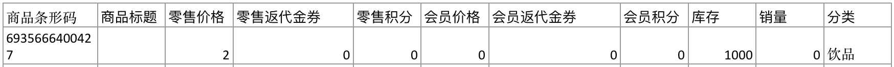
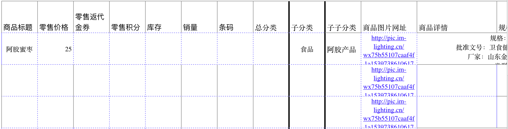
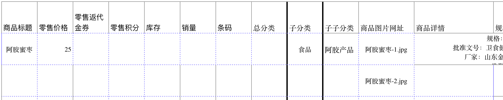

# 导入商品

可通过下面几种方式导入商品，选择适合自己的方式即可：

* 通过excel 条形码批量导入
* 通过excel 商品模板批量导入
* 从其他微观商城批量导入
* 通过天猫批量导入
* 通过淘宝批量导入
* 通过甩手掌柜\(微店、有赞\)批量导入

## 通过excel 条形码批量导入

适用于超市、便利店等有条形码的标准商品。只需要导入条形码，商品名称、价格、图片、详情等都可以自动获取，无需手动设置这些，比较省力。



## 通过excel 商品模板批量导入

如果从其他平台导出了商品，按照规则放在我们的excel模板文件里面，就可以批量导入了。这种方式类似于shopify的方式。有两点需要特殊说明：

### 如何商品分类

* 如果你商品只有一级分类，那么分类名称写在导入模板的子子分类列。
* 如果你商品只有二级分类，那么大的分类名称写在导入模板的子分类列，小的分类写在子子分类。例如假如你的商城有衣服和上衣这个分类，那么子分类写衣服，子子分类写上衣。
* 如果你商品只有3级分类，那么大的分类名称写在导入模板的分类列，次小的分类，写在子分类里面。最小的分类写在子子分类。例如假如你的商城有衣服、上衣、T恤这个分类，那么总分类写衣服，子分类写上衣，子子分类写T恤。


一个合理有序的商城是充满逻辑和规律的，我们见到了太多逻辑混乱的商城。在给商品分类之前，先正确思考商品分组和商品品牌以及商品分类之间的区别。从最开始规划好商品的展示逻辑。最后，我们不推荐2级以及三级分类，尽可能用一级分类。


### 如何导入商品主图

* 如果商品主图已存在网上，可以把图片网址放到表格文件。在导入商品时候，我们会自动把图片从网上下载下来，保存到我们系统。
* 如果商品没有在网上，而是在你的电脑上，可以按照这个3个步骤去做：1.给你电脑上的图片重新命名，例如你的现在图片名称叫：water.jpg,  你要把他作为娃哈哈钙奶这个商品的主图，就可以吧water.jpg改成：娃哈哈.jpg,如果商品主图有多个，可以分别写成娃哈哈-1.jpg,

  娃哈哈-2.jpg,娃哈哈-3.jpg,主图数量不可超过4张，超过4张自动丢弃。2.批量上传图片到后台商城。3.把你的刚才写的图片名称写进导入商品模板，商品图片名称必须一致，否则导入失败。

图片分别在网上和在本地的示例：

网上图片：

本地图片：





### 多规格商品的导入




我们支持多规格商品的导入，但是我们发现大量的客户把规格用到了匪夷所思的地步，所以默认我们不支持多规格的导入，如果您确实需要导入多规格，请和我们联系，我们会评估您的需求，并给出最佳的实践。


## 从其他微观商城批量导入

多用于新旧商城账号之间的数据迁移，可以导入另一个商城的商品。

## 通过天猫批量导入

用官方的淘宝助手导出csv文件，并且保存成utf8格式。


如果导入失败，请检查两个地方：1.用官方的淘宝助手导出csv文件，2.并且保存成utf8格式。


## 通过淘宝批量导入

方法和天猫一样。

## 通过甩手掌柜\(微店、有赞\)批量导入

需要按照这两个步骤：

1. 批量上传导出的图片到微观商城。
2. 在上传csv文件。

