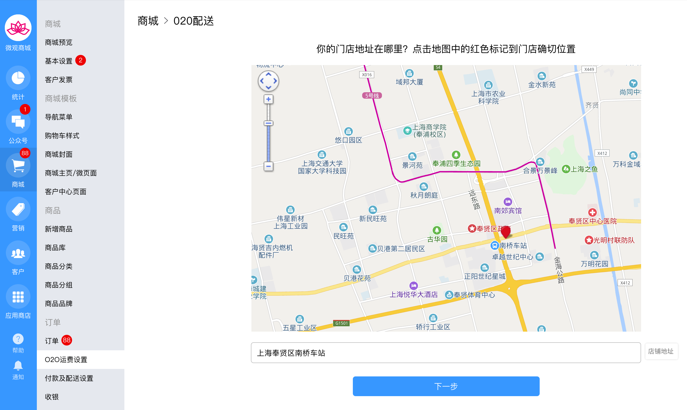
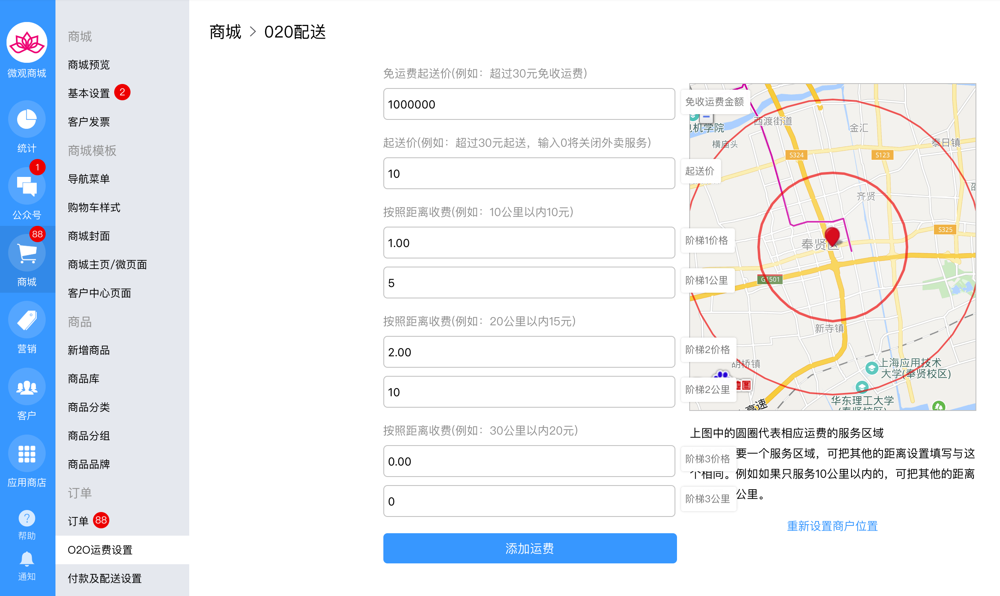
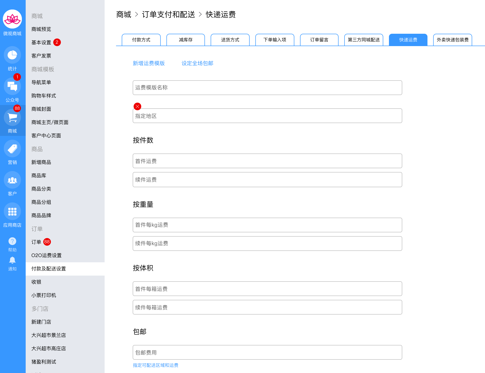
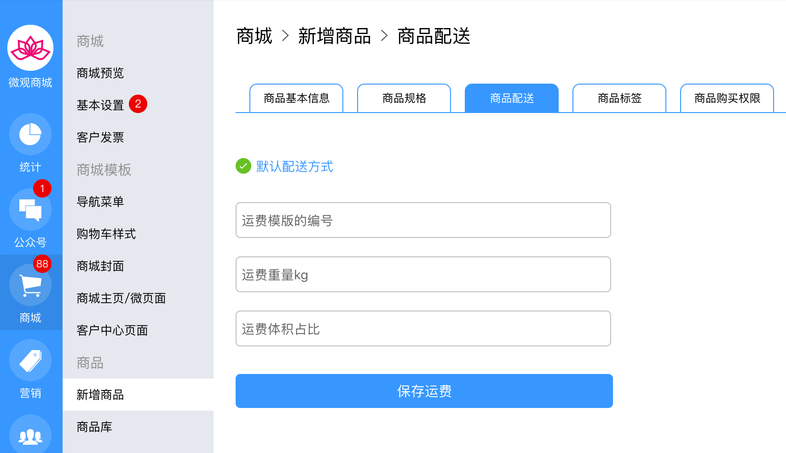

# 运费

## 运费两种类型

* 同城o2o运费
* 快递运费

### 同城o2o运费

当商城开启了外卖配送模式，会按照客户下单的位置，计算距离，根据距离计算配送费。该模式有以下几个特点：

* 可支持起送价
* 可支持免运费价格
* 可支持按距离计算配送费
* 可支持超距计算

#### 使用步骤

1. 设置商家的服务位置，以此作为中心点计算配送半径。   

2.设置配送距离，起送价和免运费价格。

### 快递运费

快递运费的设置维度有以下四个。当然也可以设置全场的包邮费用。

* 按距离
* 按件数
* 按重量
* 按体积

#### 快递运费的设置步骤

1.新建快读模板。

2.给商品设置对应的运费模板和设置重量和体积等。


商品重量可写小数，例如输入0.3，指的是0.3千克。商品体积，如果每箱可以放一个商品，则输入1，如果每箱放2个商品，输入2，如果每箱放6个商品，输入6. 计算的时候体积向上取整。例如每箱放置6个商品，如果客户购买9个，那么按照2箱来计算。


