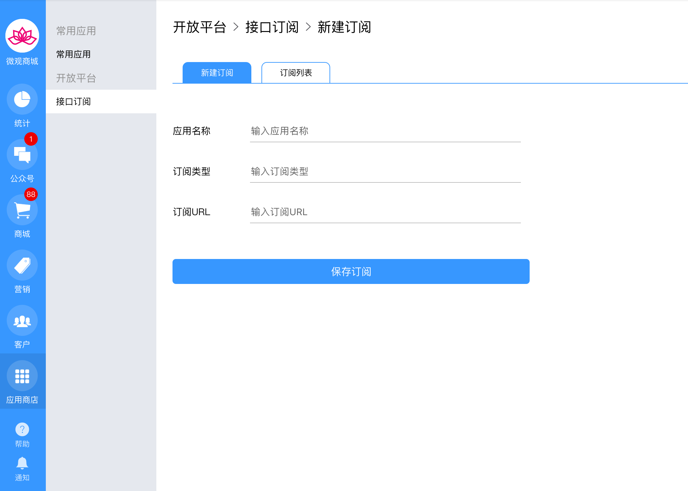
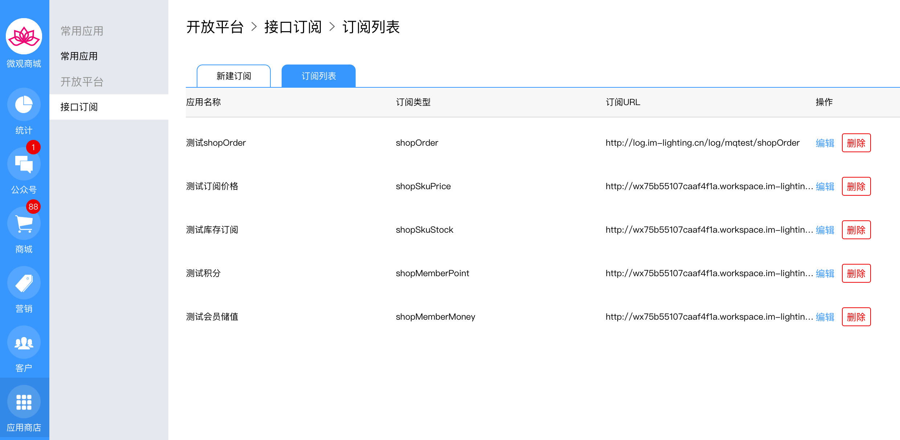

# 概述

## 如何新建订阅？

可新建订阅的接口有订单、新增用户、用户储值变动、用户积分变动、商品价格变动、商品库存变动。

### 输入参数：

* _应用名称_，可随意填写，方便自己即可。
* _订阅类型_，选择你需要的类型。
* _订阅url_，url是自己开发的用于接受微观商城推送消息的网址。


微观商城的所有数据都是POST方式发送到客户订阅URL。而且数据放在了BODY里面。例如：如果您是php来接受微观商城的数据，除了把url设置为POST访问形式外，接受数据用$\_POST。注意：如果用_file_\__get_\__contents_\("_php_://_input_"\)你将得到为空的结果。其实可看成微观向你的地址提交了一个表单。


## 接口发送数据规范

除了发送常规的信息外，还会附加一些特定信息，消息体的格式如下：

* _msgId_，标记每条消息，如果消息失败，后续补偿消息时msgId不变。需要按照消息id处理自己的业务逻辑，不要重复操作，例如储值请求，如果重复处理消息就会重复储值。
* _msgType_，标记消息类型，例如订单消息是shopOrder，新增会员是shopMember等
* _msgBody_，消息体内容，包含appId和content两个部分，appId就是你的微信公众号id（wx开头的18个字符串），content就是有关业务的消息具体内容。


注意按照消息id正确处理业务逻辑，防止一条消息重复操作，造成数据混乱。


