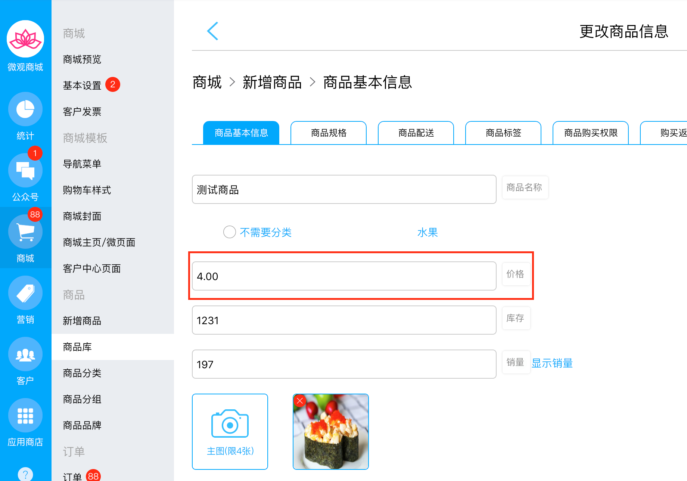

# 商品价格接口

## 接口关键词

shopSkuPrice

## 接口触发场景

* 只有在新建或是修改商品价格时触发。

例如下图位置：

## 接口内容

* barCode，商品id
* price，商品价格

例如这是商品价格消息体：

`{"appId":"wx75b55107caaf4f1a","content":{"barCode":"188889565X","price":"4.00"}}`

