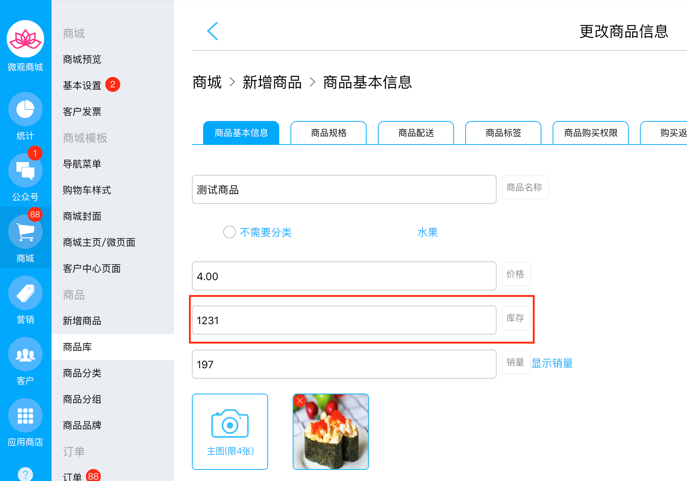

# 商品库存接口

## 接口关键词

shopSkuStock

## 接口触发场景

* 只有在新建商品和编辑商品，手动更改商品库存时触发。例如下图位置：


客户下单成功，减库存不会触发该接口，因为发送的订单消息里面已经包含了商品信息。可用订单里面的商品信息减库存。


## 接口内容

* barCode，商品条形码
* stock，设置的库存

例如下面是具体的消息体格式：

`{"appId":"wx75b55107caaf4f1a","content":{"barCode":596,"stock":"10230"}}`

