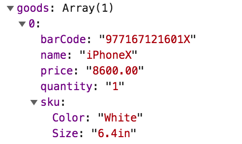

# 订单接口

## 接口关键词

shopOrder

## 接口触发场景

* 客户下单时触发，无论货到付款、会员卡支付、优惠券支付、微信支付或是其他任何支付，只要下单了就会触发。

## 接口内容

* orderId, 订单号
* openId，下单人公众号openid
* miniAppOpenId，下单人小程序Id
* phone，下单人手机号
* extInputInfo，下单扩展输入项
* goods，商品
* money，下单金额
* paytype，支付方式
* time，下单时间
* addr，送货信息

### goods的结构体

`[{"barCode":"977167121601X","name":"iPhoneX","price":"8600.00","quantity":"1","sku":{"Size":"6.4in","Color":"White"}}]`



### extInputInfo结构体

这是客户输入的自定义表单功能，例如海外购物需要客户输入姓名和身份证图片，通过这个接口能够得到。

`{\"\u5347\u9ad8\":\"ww\",\"\u59d3\u540d\":\"\u9009\u9879\",\"\u540d\u79f0\u4e0a\u4f20\":\"http:\/\/pic.im-lighting.cn\/wx75b55107caaf4f1a154677309647791.jpg\",\"\u4f53\u578b\":\"http:\/\/pic.im-lighting.cn\/wx75b55107caaf4f1a154677310184662.jpg\"}`


### 消息体整体格式

```text
{"orderId":"wx75b55107caaf4f1a19030508368031","phone":"18402140338","openId":"owxJlv23ZNTM0Mt3Qkcp_rhTKJIM","miniAppOpenId":"ohDny0NB7HUbILt82oxy5VJbQaGw","goods":[{"barCode":"977167121601X","name":"iPhoneX","price":"8600.00","quantity":"1","sku":{"Size":"6.4in","Color":"White"}}],"money":"8600.00","paytype":"0","time":"2019-03-05 08:55:30","extInputInfo":null,"addr":{"name":"mike","tel":"18402140338","country":"china","province":"\u5317\u4eac\u5e02","city":"\u5317\u4eac\u5e02","district":"\u5317\u4eac\u5e02","street":"china"}}
```

### 支付方式

* card，会员卡支付
* coupon，优惠券支付
* delivery，货到付款
* wechat，微信支付
* alipay，支付宝支付
* allinpay，通联支付
* yabandpay，雅本支付
* alphapay
* royalpay
* usagms

### 送货信息

* name，收件人姓名
* tel，收件人电话
* country，收件人国家，默认china
* province，收件人省份
* city
* district
* street，详细地址


