# 积分商城

## 积分兑换的形式

* 可兑换现金（微信钱包）
* 可兑换到会员卡
* 可兑换优惠券
* 可兑换礼品券
* 可兑换商品


从上到下，可以看到兑换的形式愈加严格，积分的可使用范围也在不断缩小，我们希望通过不同的形式，来限制积分的适用范围。


## 积分兑换活动

### 新建一个活动

如下如所示就能新建一个活动：

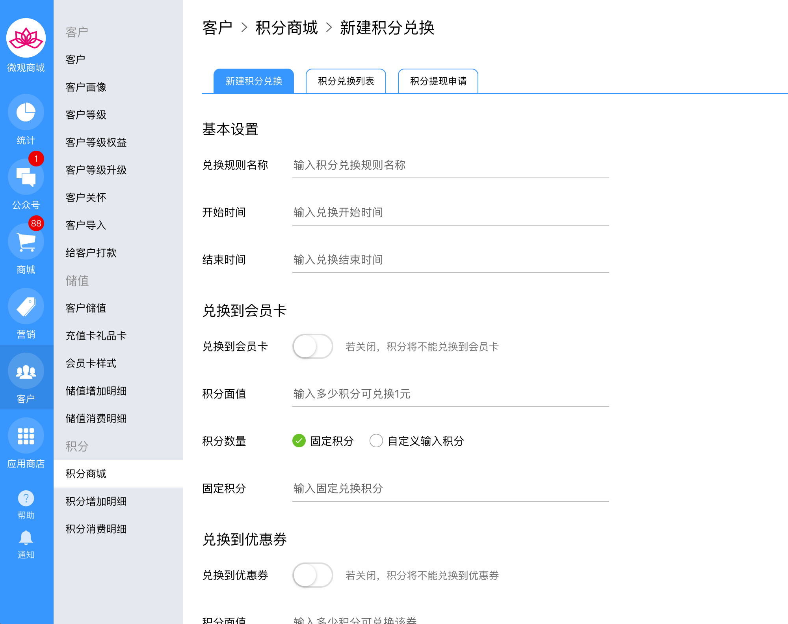

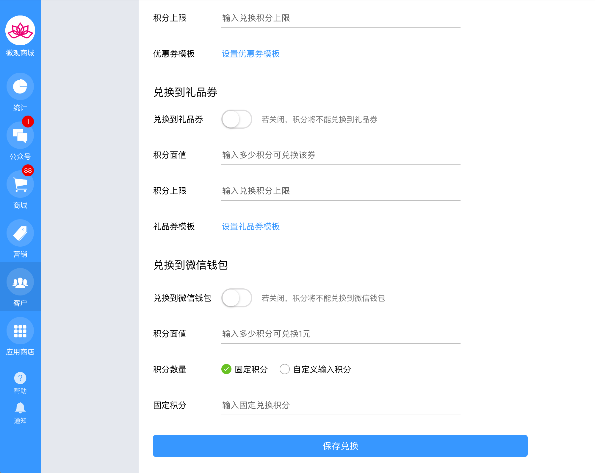


礼品券和优惠券需要先到营销栏目，新建优惠券和礼品券之后，才能在这里设置。


### 活动注意事项


您可以发布很多个兑换规则，但是积分商城将会立即启用你最新发布的规则，之前的兑换规则作废。每次积分兑换的上限也是与当前的规则规定的上限有关。例如你的积分兑换上限是100积分，我已经兑换了100积分，虽然不能兑换了，但是如果您此时发布了一个新的活动。那么我可以继续兑换，因为在新的兑换活动下，我已经兑换的积分是0.  已经发布的积分兑换规则，可以编辑，但是为了避免客户疑惑，不推荐做过大范围的修改。


### 积分活动举例

#### 兑换到会员卡

后台配置：

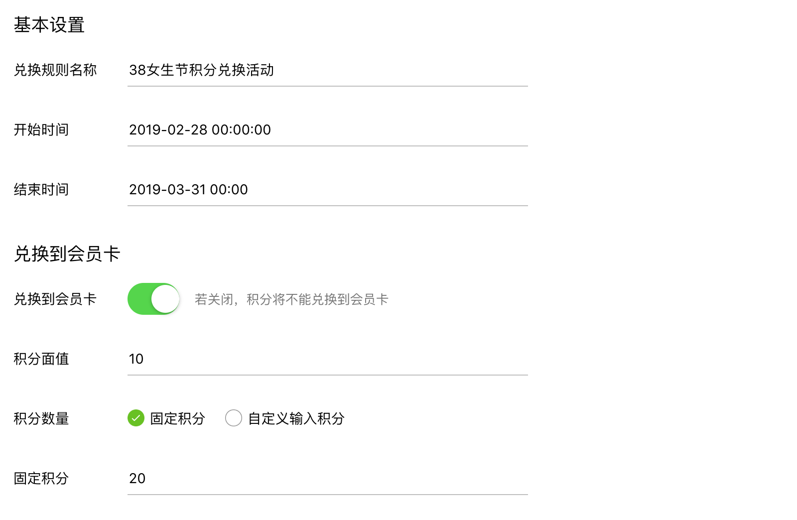

手机商城效果：

* 左侧是可输入的积分，输入值受当前总积分、积分上限、活动积分下限的约束
* 右侧是固定积分兑换，商家设定多少，只能兑换多少。

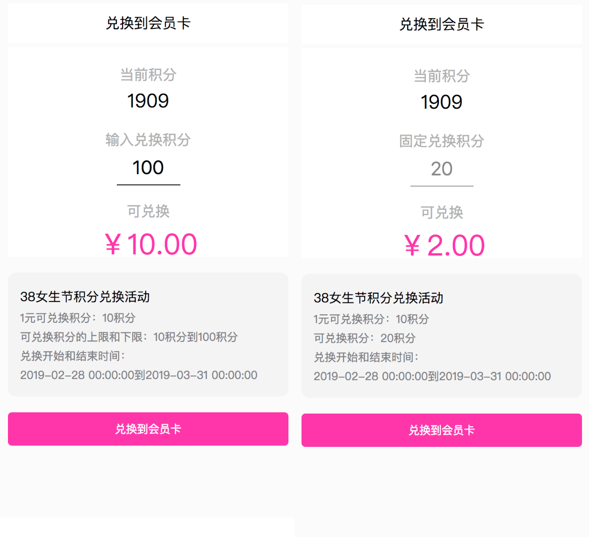

#### 兑换到现金

也就是兑换到微信钱包

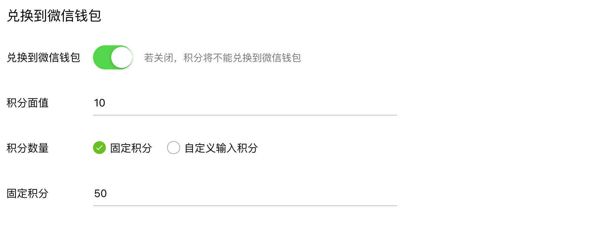

手机浏览：

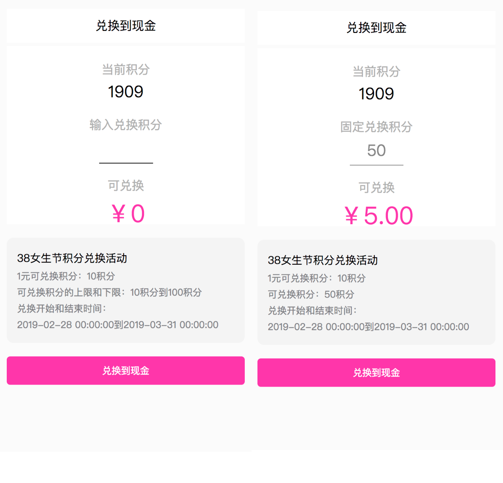

后台操作兑换到微信钱包：

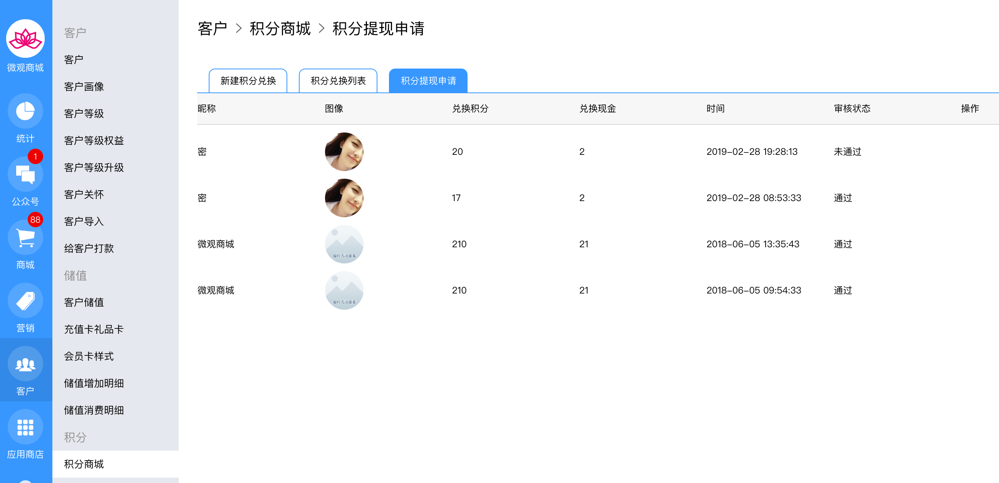


不同于其他的兑换，客户点这里的兑换，资金并不能直接进入他的微信钱包，需要商家后台系统点同意后，才能通过企业转账或是企业红包的形式发送给客户。


#### 兑换到优惠券

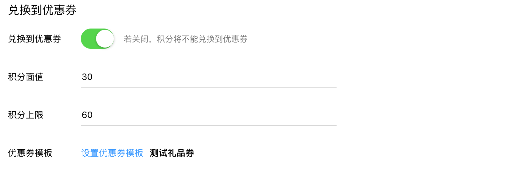


例如30积分可兑换一张优惠券，那么这里的面值输入30 ，如果只允许兑换一张优惠券，积分上限写30，如果可以兑换2张，积分上限写60. 具体兑换多少，由客户自己决定。设置优惠券模板之前，需要先在**营销/优惠券/新建优惠券**页面来完成


手机预览如下，可点优惠券右上角的绿色勾，不选择兑换。

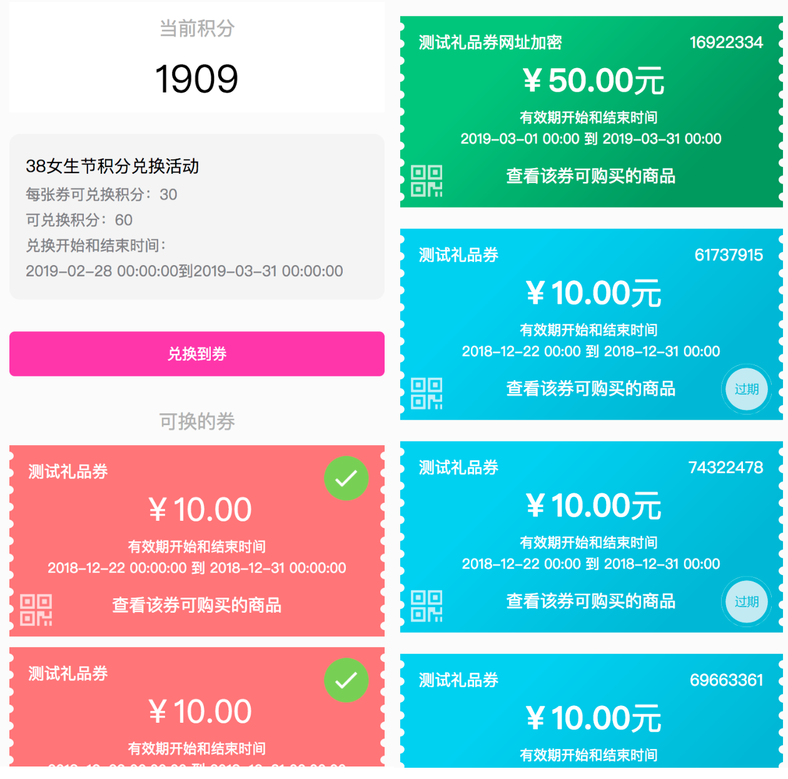


兑换成功后，可在我的优惠券页面查看。


#### 兑换礼品券

和优惠券一样，不在复述。

#### 兑换商品

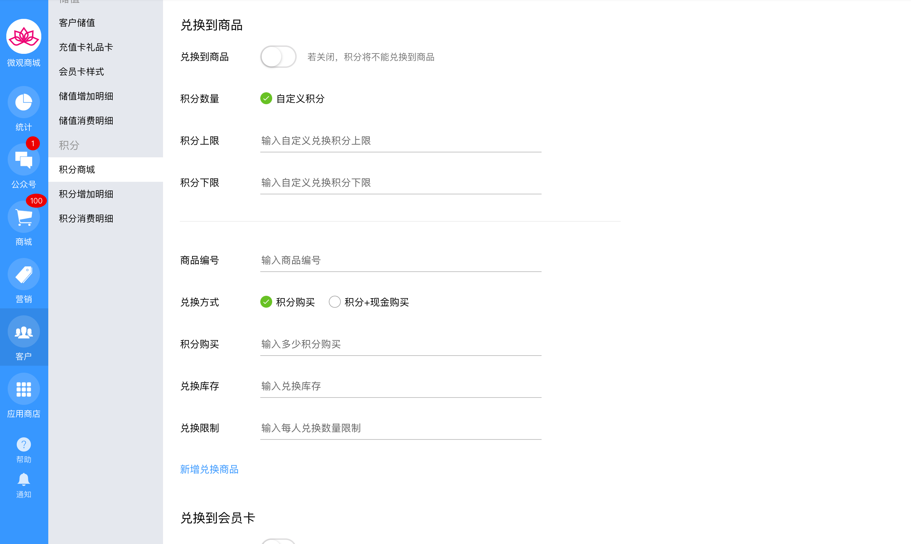

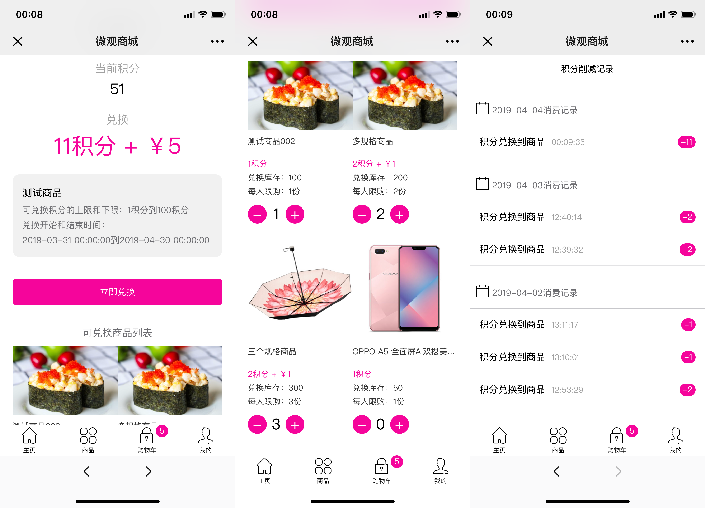

