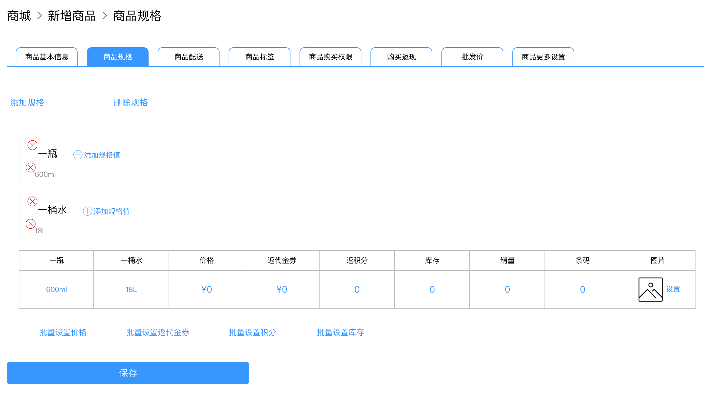
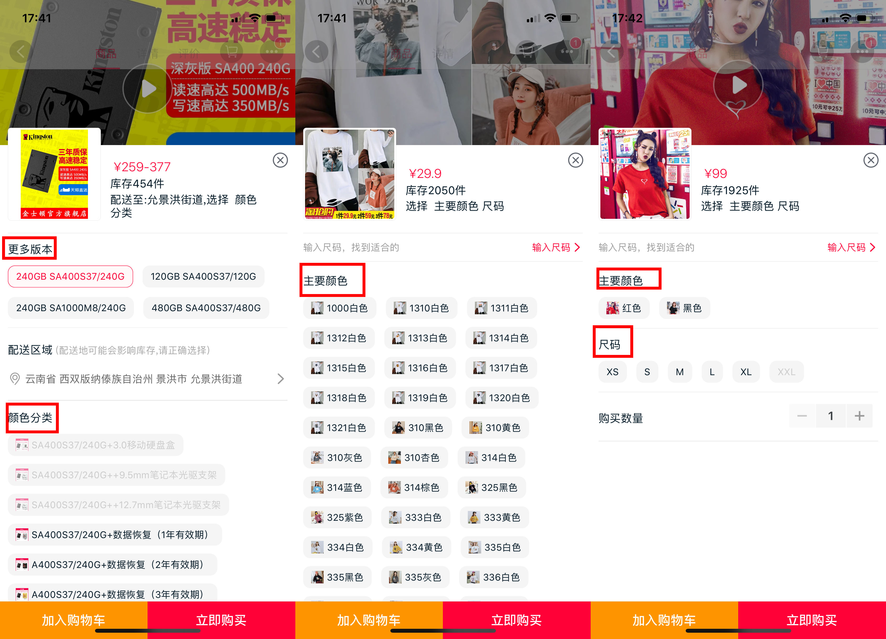
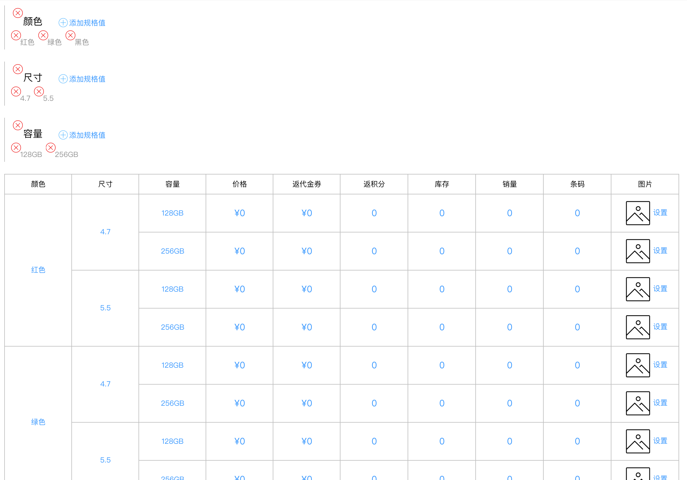
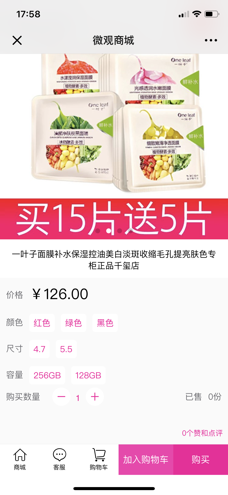

# 创建多规格商品

客户在创建多规格商品时，往往陷入困境，举个例子：一个卖水的客户可能希望一桶水的价格和一瓶水的价格是不一样的。他可能会这样去建立规格：


客户疑问产生了，不解和困惑，随之而来，因为他要给一桶水和一瓶水设定不同的价格。而如上图所示，价格只有一个。无法继续。怎么破这个问题？


## 一个测试

其实如果想要正确的建立规格，需要有分类归纳的能力。请认证看下面考题，我们测试下你是否有该能力：

* 红色、绿色、蓝色可归纳成什么名称？
* 4.5寸、5.5寸、6.5寸可归纳为什么名称？
* wifi、4G、5G可归纳成什么？
* 100W、200W、1KW可归纳成什么？
* 上例中的一桶 、一瓶可归纳成什么？
* 600ml、1.5L、6L可归纳成什么？

## 为什么需要给这个测试

请看这里，以天猫为例。

请看红色框里面的标记，而这正是客户思维中没有归纳的。

## 测试的对应答案

* 可归纳成颜色
* 可归纳成尺寸
* 可归纳成网络
* 可归纳成瓦数
* 可归纳成容量
* 可归纳成体积


如果您没有这种归纳能力，请寻求技术支持给您建议。


## 正确的实践

请看下图，一目了然：

请看手机端的展示：

